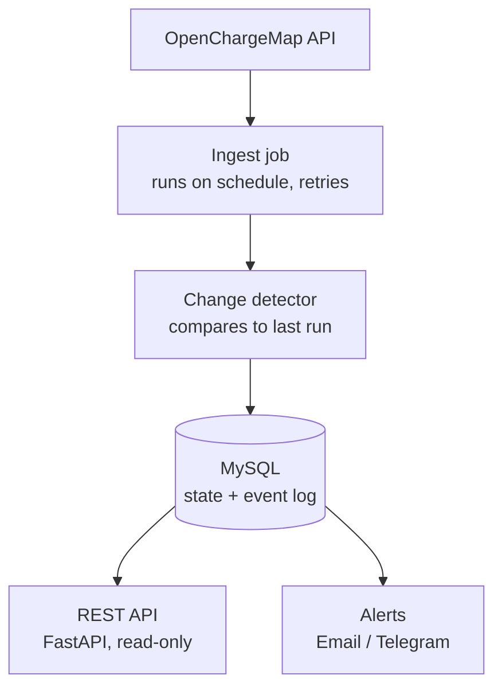

# EV Monitor — Research & Design Notes

Consolidated from the earlier research files (`ev-monitor.odt/.pdf`, `db-schema.odt`, `DB-schema.odt`, `Openchargemap-api.png`).

---

## 1. Problem

The Netherlands has roughly 15,000 public EV charging points. [Open Charge Map](https://openchargemap.org) (OCM) publishes where they are, who operates them, what power they deliver, and whether they are currently reported as working.

The OCM API only tells you what is true **right now**. Yesterday's picture is gone — nobody stores it. So these questions can't be answered from the source alone:

- Has this charger in Utrecht been broken for two days, or two months?
- Which operator has the worst reliability record?
- Did forty chargers quietly disappear from Amsterdam last month?
- Is the network growing or shrinking in my province?

EV Monitor answers them by doing the one thing the source doesn't: **it remembers**.

> A snapshot tells you the state. A sequence of snapshots tells you the story.

## 2. Data source — Open Charge Map

| Item | Value |
|---|---|
| Endpoint | `https://api.openchargemap.io/v3/poi` |
| Reference data | `https://api.openchargemap.io/v3/referencedata` (lookup lists for status, operator, connection type, …) |
| Auth | API key from an app registered at `openchargemap.org/profile/applications` (app name `ev-monitor`). The key is read from the `OCM_API_KEY` env setting — never commit it. |

### 2.1 Shape of the response

The response is an array of charging locations (OCM calls each a **POI**). Each object is one physical site.

**Station (top level)**

| Field | Meaning |
|---|---|
| `ID`, `UUID` | Station identity. `ID` is an integer; `UUID` is a stable global key. |
| `OperatorID` | Who runs it (e.g. 3884, 3632). |
| `DataProviderID` | Who supplied the record to OCM. |
| `UsageTypeID` | Access type (public / private / membership required, …). |
| `AddressInfo` | Nested location: title, street, town, province, postcode, lat/long, sometimes phone or URL. |
| `Connections` | Array of the actual plugs at the site. |
| `NumberOfPoints` | Roughly how many charge points. |
| `StatusTypeID` | Operational status of the whole site. |
| `DateLastStatusUpdate` | When that status last changed at the source. |
| `DateLastVerified`, `IsRecentlyVerified` | When a human/provider last confirmed the record. |
| `DateCreated`, `DataQualityLevel`, `SubmissionStatusTypeID` | Housekeeping (200 = published/live, 100 = submitted/imported). |

**Connection (each entry in `Connections`)**

| Field | Meaning |
|---|---|
| `ID` | Connector id. |
| `ConnectionTypeID` | Plug standard (CCS, Type 2, CHAdeMO, …). |
| `PowerKW`, `Amps`, `Voltage` | Electrical rating. |
| `CurrentTypeID` | AC / DC. |
| `LevelID` | Slow / fast / rapid. |
| `Quantity` | Number of identical plugs. |
| `StatusTypeID` | Status of this plug (can differ from the site). |

**`StatusTypeID` codes**

| Code | Meaning |
|---|---|
| 0 | Unknown |
| 10 | Available |
| 20 | In use |
| 30 | Temporarily unavailable |
| 50 | Operational |
| 75 | Partly operational |
| 100 | Not operational |
| 150 | Planned |
| 200 | Removed |

In practice almost everything is 50; a handful are 100, 75, 0, 150.

> **Compact mode:** fields like `StatusType`, `ConnectionType`, `Operator`, `Level`, `Country` come back `null` when the API is called in compact mode — they are the human-readable expansions of the `*ID` fields. Fetch them once from `/referencedata` or hard-code small lookup tables.

## 3. Mental model

- A **station** is a place you drive to — name, address, coordinates.
- A **connection** (charger) is a plug at that place — speed and plug type.
- **One station has many connections.** A supermarket car park with four plugs = 1 row in `stations`, 4 rows in `connections`, each pointing back via `station_id`.

Operator codes, status codes and dates are extra detail bolted onto these two entities.

## 4. Uptime tracking

One API response is a snapshot, not history. To measure uptime, **poll on a schedule** (every 15–60 min) and store what you see each time; uptime is computed from your own snapshots.

Fields that matter for up/down tracking:

- `ID` / `UUID` — which station
- `StatusTypeID` — station level, and each connection's `StatusTypeID` — plug level
- `DateLastStatusUpdate` — when the source says the status changed
- Your own poll timestamp — when you checked

Everything else (address, power, operator) is descriptive: store it once, it rarely changes.

## 5. Architecture



**Ingest job.** Wakes up on a schedule and pulls all Dutch stations page by page. Handles timeouts, 503s and rate limits with exponential backoff, gives up gracefully after N attempts, and records the failure in `ingest_runs` so gaps in history are explained.

**Change detector.** Reads the previous state from the database *before* writing anything, then compares station by station:

| Condition | Event |
|---|---|
| In the feed, not in the DB | `new` |
| In both, status differs | `status_change` |
| In the DB, missing from this run's feed | `delisted` |
| Was delisted, now back | `relisted` |

Each difference becomes a row in `status_events`, which is **append-only** — never updated or deleted. A mutable table only tells you the present; an immutable event log lets you reconstruct any past moment (same reason banks store transactions, not just a balance).

**MySQL.** Current-state tables (`stations`, …) are fast to filter ("all broken chargers in Rotterdam"); history tables walk the log ("everything that happened to station 12345"). `ingest_runs` is the operational record that turns a script into a service.

**REST API.** FastAPI, read-only: list stations with filters, one station with its full history, recent changes, ingest health. Only the pipeline writes. Swagger docs come for free.

**Alerts.** When change detection produces events matching a rule ("any station in my postcode went offline"), send a message. Telegram is the easiest to implement and demo.

The project gets more valuable over time: after a month of running there is a dataset nobody else has.

## 6. Database schema

Static/descriptive tables plus history tables populated by polling. This is the version implemented in `src/models/models.py` (all tables also carry `created_at` / `updated_at`).

```text
operators
  id                 INTEGER PK        -- OCM OperatorID
  title              VARCHAR(255)
  website            VARCHAR(255)

status_types
  id                 INTEGER PK        -- OCM StatusTypeID
  title              VARCHAR(100)
  is_operational     BOOLEAN

addresses
  id                 INTEGER PK
  title              TEXT
  address_line1      TEXT
  address_line2      TEXT
  town               TEXT              -- indexed
  state_or_province  TEXT
  postcode           TEXT
  country_id         INTEGER
  latitude           DOUBLE
  longitude          DOUBLE
  contact_no         VARCHAR(20)

stations
  id                       INTEGER PK  -- OCM ID
  uuid                     CHAR(36) UNIQUE
  operator_id              INTEGER FK -> operators.id
  usage_type_id            INTEGER
  address_id               INTEGER FK -> addresses.id
  number_of_points         INTEGER
  status_type_id           INTEGER FK -> status_types.id   -- current status cache
  date_created             TIMESTAMP   -- OCM DateCreated
  date_last_status_update  TIMESTAMP

connections
  id                 INTEGER PK        -- OCM connection ID
  station_id         INTEGER FK -> stations.id
  connection_type_id INTEGER
  current_type_id    INTEGER
  level_id           INTEGER
  power_kw           NUMERIC(8,2)
  amps               INTEGER
  voltage            INTEGER
  quantity           INTEGER
  status_type_id     INTEGER FK -> status_types.id

-- Key history table: one row per station per poll
status_snapshots
  id                 BIGINT PK AUTO
  station_id         INTEGER FK -> stations.id
  status_type_id     INTEGER FK -> status_types.id
  source_updated_at  TIMESTAMP         -- from DateLastStatusUpdate
  checked_at         TIMESTAMP         -- when our poller ran
  INDEX (station_id, checked_at)

-- Plug-level daily rollup for reporting
connection_status_daily
  id                 BIGINT PK AUTO
  snapshot_date      DATE
  station_id         INTEGER FK -> stations.id
  connection_id      INTEGER FK -> connections.id
  status_type_id     INTEGER FK -> status_types.id
  is_working         BOOLEAN
  town, postcode, operator_id          -- denormalised for fast reports
  UNIQUE (snapshot_date, connection_id)
  INDEX (connection_id, snapshot_date), INDEX (snapshot_date, is_working)
```

Planned (from the design, not yet implemented): `status_events` (append-only change log), `ingest_runs` (per-run health), and lookup tables `connection_types`, `usage_types`.

### Alternative considered

An earlier draft used a denormalised `stations` table (address columns inline, `VARCHAR` ids) and a single `status_log` table holding both station- and connector-level rows with a text `status` and derived `is_operational`. It was dropped in favour of the normalised schema above, which keeps OCM's integer ids and separates station snapshots from plug-level rollups.
